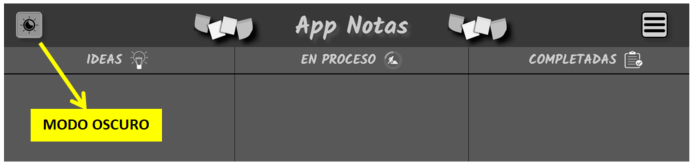
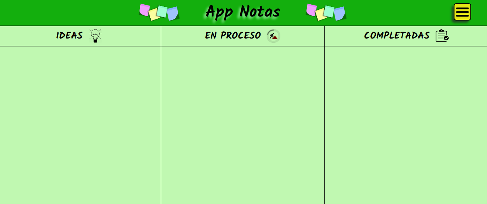
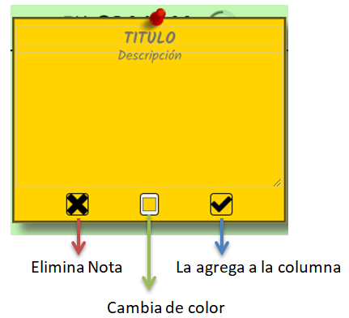
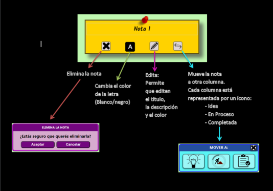
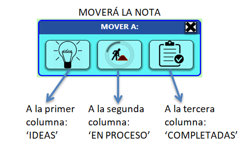

 # App Notas

Esta app te permite crear **notitas**, editarlas y guardarlas en un tablero que posee tres columnas que representan en que estado se encuentra la tarea o idea.

------------

#### Desde el menú desplegable podrá:
- Crear Nota
- Cargar Tablero
- Guardar Tablero
- Exportar Tablero
- Importar el Tablero
- Desarrolladores

	

------------

#### Modo Oscuro:

	

------------

#### El tablero tiene tres columnas que indican el estado de la tarea o idea:

- IDEAS
- EN PROCESO
- COMPLETADAS

	

------------

#### Cada nota tiene:

- Título
- Descripción
- Cuatro botones:
	- Elimina la nota
	- Cambia de color la letra (Blanco o Negro)
	- Cambia de color la nota
	- Agrega la nota en la columna del cuadro
	(Cuando la columna se agrega al cuadro, se guarda en un tamaño reducido)

	

------------

#### Nota en tamaño reducido: 
La descripción estará oculta y podrá verse cuando se presione el botón editar.

Contenido de la nota reducida:

- Descripción
- Botones:
	- Elimina
	- Cambia de color la letra
	- Edita el título, la descripción, el color de la nota
	- Cambia de columna

	

##### También puede cambiar de columna arrastrando la nota:

	
 

🔷 🔸 🔸 🔸 🔸 🔸 🔸 🔸 🔸 🔸 🔸 🔸 🔸 🔸 🔸 🔸 🔷 
##### Autores: Lionel Staricoff & Gladys Romero
&copy; Copyright

🔷 🔸 🔸 🔸 🔸 🔸 🔸 🔸 🔸 🔸 🔸 🔸 🔸 🔸 🔸 🔸 🔷

